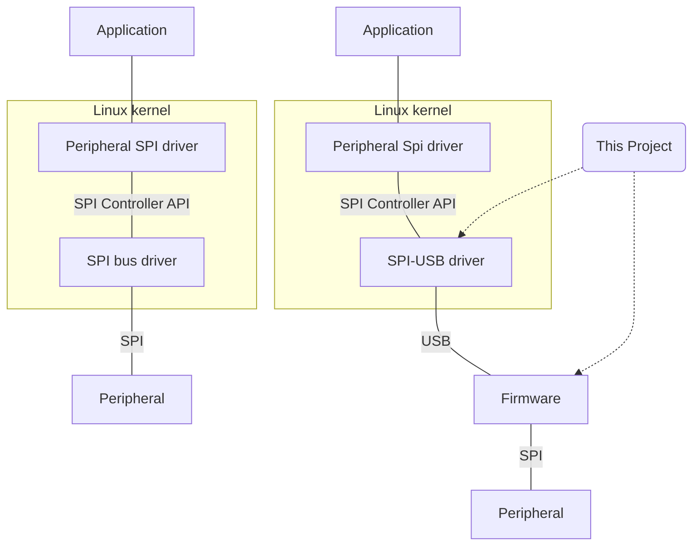

# USB-SPI Kit

This repo contains a stack of [ATSAMDx1 USB device firmware](/atsamd-usbd-spi) (only tested on ATSAMD21), [USB protocol](/protocol), Linux kernel [usb-spi driver](/driver-kernel), and a [demo spi driver](test-driver).  These work together to provide a standard Linux SPI controller, which connects to the SAMDx1 over USB and uses its SERCOM peripheral for the physical layer.

For instance, a person could wire an SPI peripheral (a radio module, analog to digital converter, memory, display, etc) to a SAMD21 development board (Adafruit Feather M0, Arduino Zero, etc), connect the board to a Linux host via USB, and run a Linux program that interacts with the peripheral as if it were connected directly to an SPI controller in the host computer.  The linux program might interface with a kernel driver specific to the SPI peripheral, or the linux program could use the generic [spidev](https://www.kernel.org/doc/html/latest/spi/spidev.html) interface.

## Design goals and non-goals
I originally wrote this for a work project, basically taking an SPI peripheral that had been connected directly to a SoC and moving the peripheral to a SAMD21 that connects to a new main SoC over USB.  So, the main aim was to support the SPI functionality used by the peripheral and its Linux kernel-mode driver.  But, this seems sufficiently generic to possibly be useful for other things.  In particular, I see this as a useful prototyping and development tool.

### Goals
* Provide a standard-looking SPI interface from the application's perspective.
* Enable development of applications and drivers for SPI peripherals, where the peripheral can be wired either directly to an SPI bus on the host machine, or an SPI on a microcontroller that's connected to the host via USB.

### Non-goals
Speed is not much of a concern in the original application.  So, this might not be a good choice for higher bandwidth or lower-latency applications.  I have not profiled this stack, but offhand there are some easy gains that could be made in the firmware to reduce `memcpy()`-ing the SPI data to/from the USB bulk endpoints.  The protocol only puts one transaction in each USB transfer, that could probably be changed fairly easily to a streaming approach.

## TODO
* Add a complete example firmware application.
* Make the firmware more generic - ideally it would look more like a `usb-device` class implementation, which is generic over peripherals that implement SPI and interrupt traits.
* Add a userspace driver based on libusb, that implements those same SPI and interrupt traits that the generic firmware would use.  This would allow development of SPI peripheral drivers on a regular PC, that could then be dropped straight in to tiny embedded targets.
* Make a defmt feature flag in the atsamd-usbd-spi crate.
